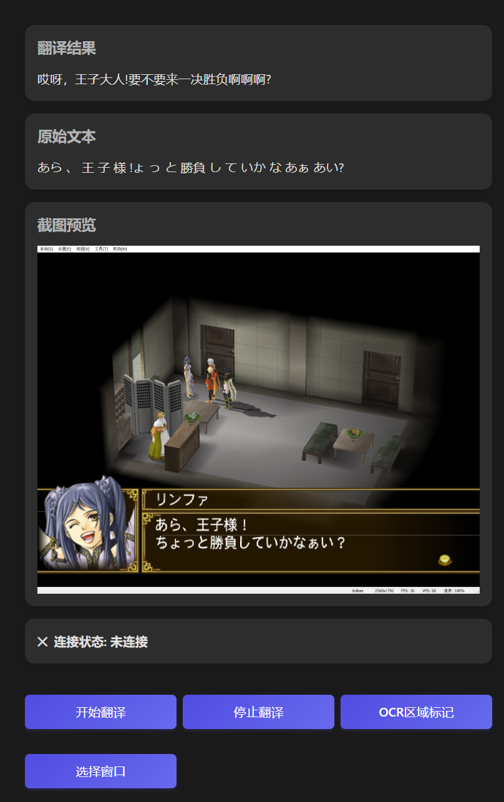

# Transin

Transin is an experimental project I made to translate text from games that in game console emulator(eg. PCSX2).

## Preview



## Design

- use [node-screenshots](https://github.com/nashaofu/node-screenshots)([xcap](https://github.com/nashaofu/xcap)) to capture emulator's screen
- use [Tesseract.js](https://github.com/naptha/tesseract.js/) to do OCR, get text from specific regions of screenshots
- (currently) use [volcengine(火山翻译)](https://translate.volcengine.com/api) to translate text
- output original text, translation and screenshots to GUI(in web)

## Quick Start

Install latest version of Bun(currently 1.2.3) first.

```bash
bun install
```

To run:

```bash
bun run src/index.ts
```

This project was created using `bun init` in bun v1.2.2. [Bun](https://bun.sh) is a fast all-in-one JavaScript runtime.
